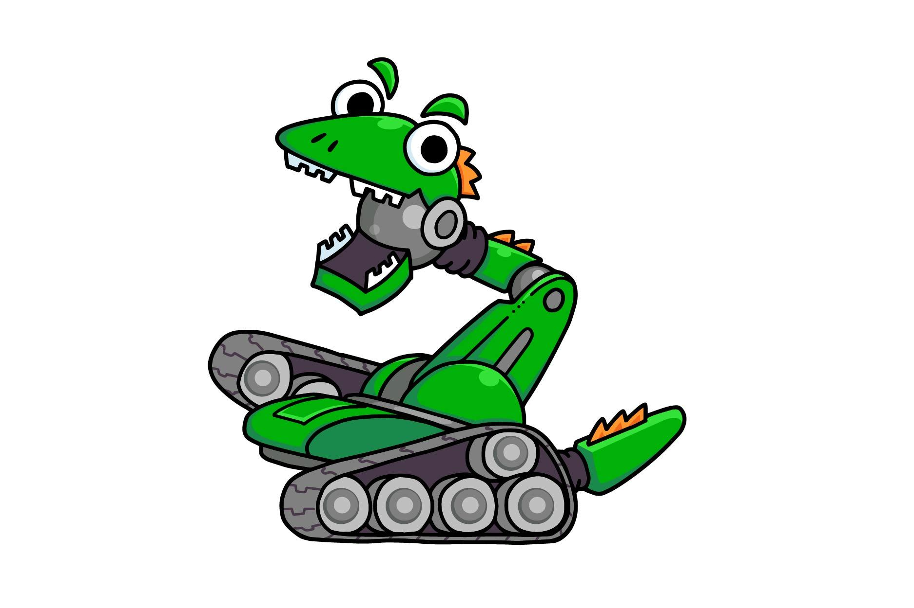

# あいうえお
## かきくけこ　がぎぐげご
これはテストです。

これが改行を意味するようだね。
## たちつてと
これはとてもテストです。
## さしすせそ
これは**非常**に、*非情*なまでのテストです。
- 役に立つ
- 役に立たない
- どちらでもない
## なにぬねの
これはレポート書くために、結構便利かもしれない。使ってみようかな。

|あい|うえ|
|--|--|
|資料 |かき くけ|
|資料 |かき くけ|
|資料 |かき くけ|

## 消すためだけに存在する文章とは
VSCODEでのコミット